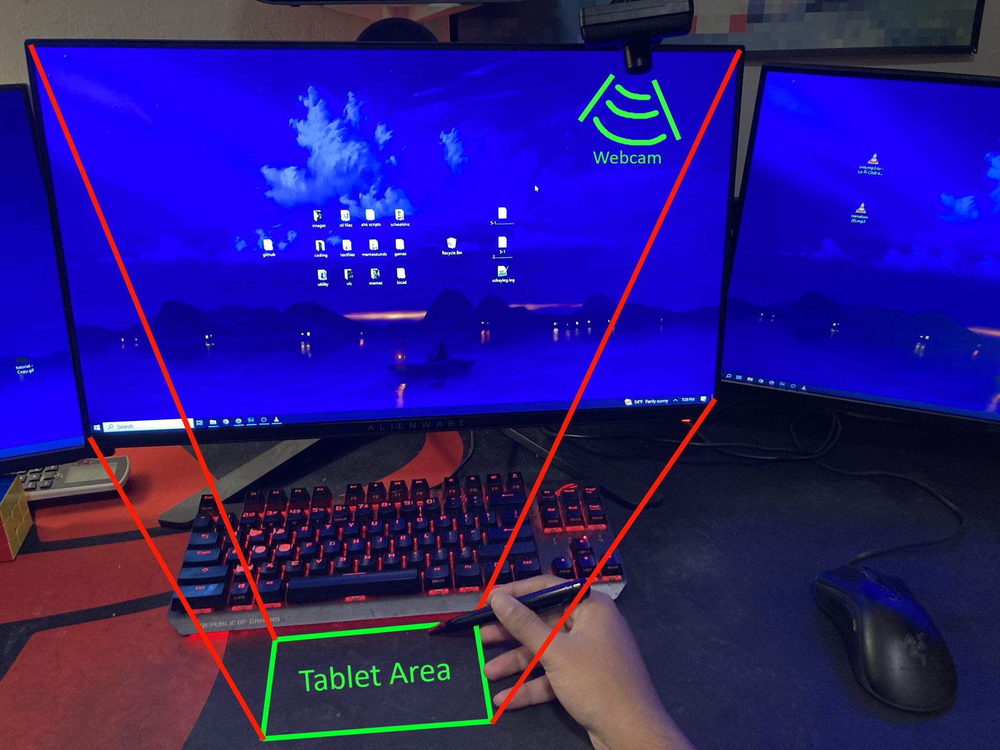

# Webcam Tablet
Turn any surface on your desk into a functional tablet. 
<h1><a id="title" href="https://youtube.com" target="_blank">Video Tutorial</a></h1>
</img>
</img>
Feel free to contribute, and post any issues you have here on the <a href="https://github.com/WarpRomo/webcam-tablet/issues">issue</a> tab of github. 
If you have questions regarding the code, contact me on discord. My discord tag is "oeci"
