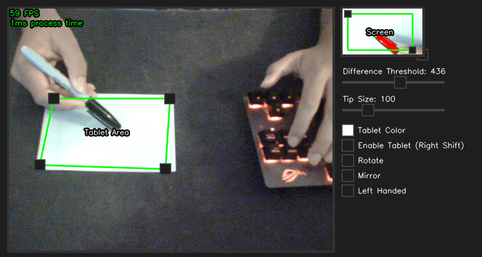

# Webcam Tablet
Turn any surface on your desk into a functional tablet. 
<h1><a id="title" href="https://youtu.be/mBDaXqowUFw&t=186s" target="_blank">Video Tutorial</a></h1>
</img>
</img>
</img>

Use a 60 fps camera for best experience.  I recommend the "PS3 Eye Camera", which you can find in many stores for <10$

Feel free to contribute, and post any issues you have here on the <a href="https://github.com/WarpRomo/webcam-tablet/issues">issue</a> tab of github. 
If you have questions regarding the code, contact me on discord. My discord tag is "oeci"
